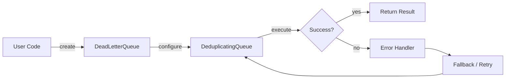
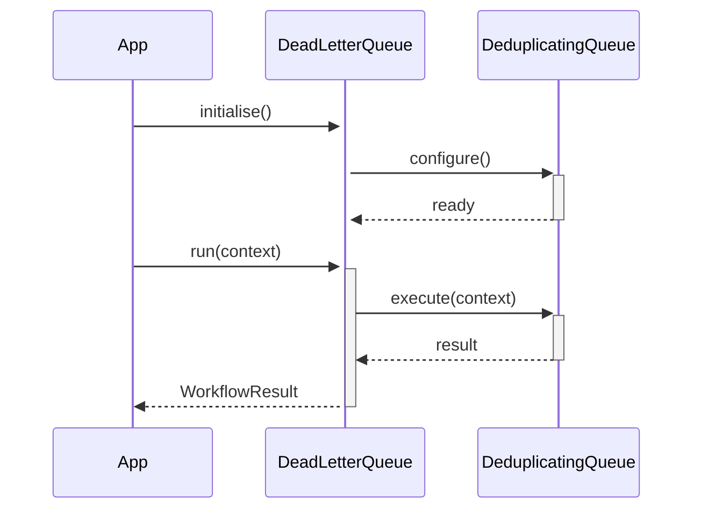

<div align="center">

</div>

# agent-queue

**Priority task queue for multi-agent systems**

[](https://pypi.org/project/agent-queue/) [](https://python.org) [](LICENSE) [](#)

---

## The Problem

Without a task queue, agents under load drop work silently, process tasks in arrival order regardless of urgency, and have no back-pressure — a burst of requests causes cascading timeouts rather than graceful queuing.

## Installation

```bash
pip install agent-queue
```

## Quick Start

```python
from agent_queue import DeadLetterQueue, DeduplicatingQueue, QueueFullError

# Initialise
instance = DeadLetterQueue(name="my_agent")

# Use
# see API reference below
print(result)
```

## API Reference

### `DeadLetterQueue`

```python
class DeadLetterQueue:
    """Stores tasks that have exhausted all retries or failed permanently."""
    def __init__(self, maxsize: int = 100) -> None:
    def add(self, task: Task, reason: str) -> None:
        """Add a failed task with an explanatory reason.
    def list(self) -> list[dict]:
        """Return a list of all dead-letter entries (copies)."""
    def count(self) -> int:
        """Number of entries in the dead-letter queue."""
```

### `DeduplicatingQueue`

```python
class DeduplicatingQueue(TaskQueue):
    """
    def __init__(self, max_size: int = 1000) -> None:
    def put(
    def put_nowait(self, task: Task) -> None
```

### `QueueFullError`

```python
class QueueFullError(Exception):
    """Raised when pushing to a full bounded queue."""
```

### `TaskQueue`

```python
class TaskQueue:
    """In-memory priority queue for Task objects.
    def __init__(self, maxsize: int = 0) -> None:
        """
    def push(self, task: Task) -> None:
        """Enqueue a task.
    def pop(self) -> Optional[Task]:
        """Remove and return the highest-priority task, or None if empty."""
    def peek(self) -> Optional[Task]:
        """Return the highest-priority task without removing it, or None."""
```


## How It Works

### Flow



### Sequence



## Philosophy

> *Antya karma* — the final action is determined by the order of deeds; FIFO is dharma applied to tasks.

---

*Part of the [arsenal](https://github.com/darshjme/arsenal) — production stack for LLM agents.*

*Built by [Darshankumar Joshi](https://github.com/darshjme), Gujarat, India.*
